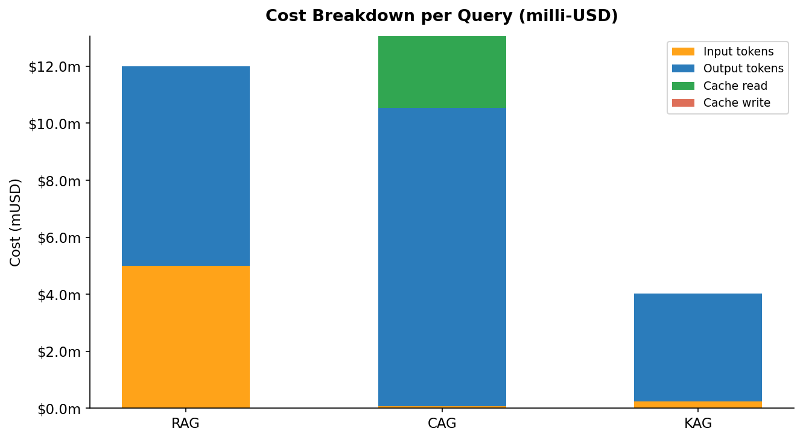
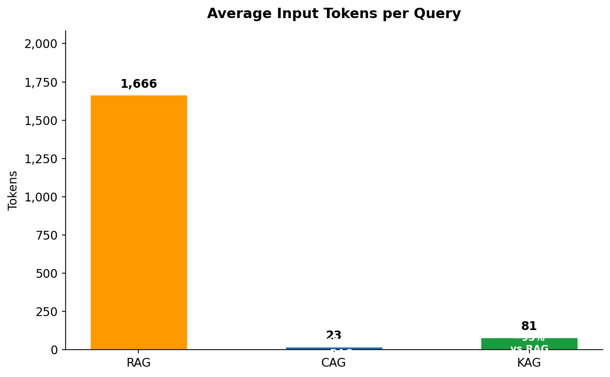
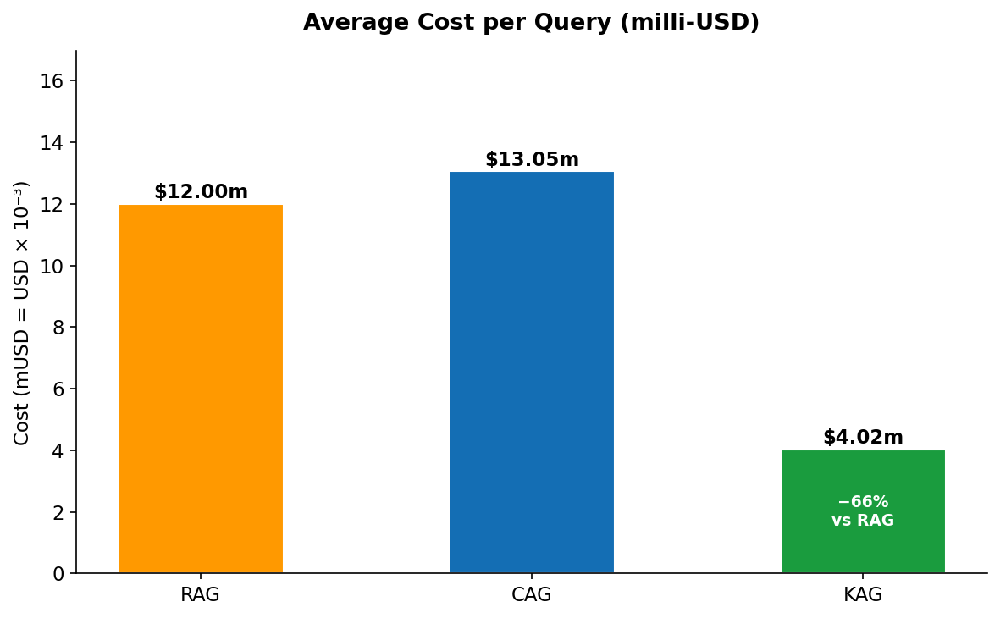
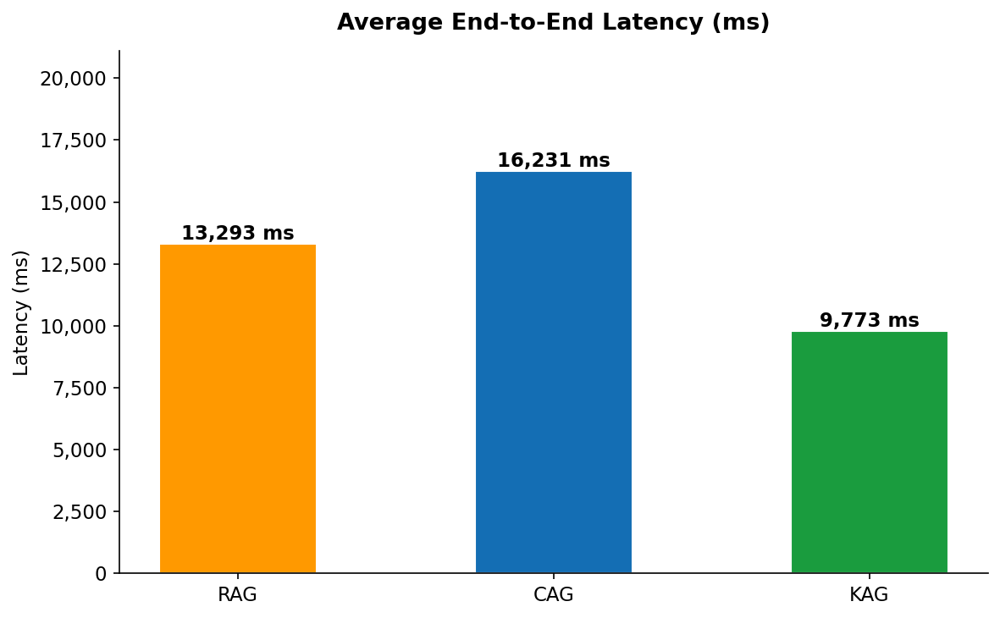

# 🚀 RagOps: RAG vs CAG vs KAG Benchmark

**A comprehensive comparison of three AI retrieval methodologies on AWS: Retrieval-Augmented Generation (RAG), Cached-Augmented Generation (CAG), and Knowledge-Augmented Generation (KAG).**

[](https://aws.amazon.com/bedrock/)
[](https://www.python.org/)
[](https://www.terraform.io/)
[](LICENSE)

---

## 🎯 Key Findings

After running **180 benchmark queries** (60 per method × 3 runs), here are the results:

| Method | Avg Input Tokens | Avg Output Tokens | Avg Cached Tokens | Cost per Query | vs RAG |
|--------|-----------------|-------------------|-------------------|----------------|---------|
| **RAG** | 1,666 | 467 | 0 | **$12.00m** | baseline |
| **CAG** | 23 | 698 | 8,390 | **$13.05m** | +8.8% ⚠️ |
| **KAG** | 81 | 252 | 0 | **$4.02m** | **-66.5%** 🏆 |

### 💡 Critical Insights

1. **KAG is the clear winner** - 66.5% cost savings by using precise graph queries instead of broad vector search
2. **CAG paradox** - Despite 90% savings on cache reads ($0.30/M vs $3/M), CAG generates 49% more output tokens, making it 8.8% more expensive overall
3. **Token efficiency ≠ Cost efficiency** - CAG saves 98.6% of input tokens but still costs more due to output token generation

---

## 🏗️ Architecture


### AWS Services Used

- **Amazon Bedrock** - Claude Sonnet 4.6 with Prompt Caching
- **Amazon Neptune Serverless** - Graph database for KAG (1-8 NCU auto-scaling)
- **Amazon S3** - Document storage, embeddings, benchmark results
- **VPC Endpoints** - Private connectivity (Bedrock Runtime, S3 Gateway)
- **CloudWatch** - Logs, Metrics, and Dashboard monitoring
- **Terraform** - Infrastructure as Code for reproducible deployments

### Methodology Comparison


---

## 🛠️ Tech Stack

**Infrastructure:**
- Terraform (AWS VPC, Neptune, Bedrock, IAM, CloudWatch)
- AWS SDK for Python (boto3)

**AI/ML:**
- Amazon Bedrock (Claude Sonnet 4.6)
- Titan Embeddings V2
- FAISS (vector similarity search)
- Gremlin (graph traversal)

**Data Processing:**
- Python 3.12
- pandas, numpy
- matplotlib, seaborn (visualizations)

---

## 🚀 Quick Start

### Prerequisites

- AWS Account with Bedrock access enabled
- Terraform >= 1.0
- Python >= 3.12
- AWS CLI configured

### 1. Clone Repository

```bash
git clone https://github.com/romanceresnak/RAGOPS.git
cd RAGOPS
```

### 2. Deploy Infrastructure

```bash
cd terraform
cp terraform.tfvars.example terraform.tfvars
# Edit terraform.tfvars with your AWS settings
terraform init
terraform plan
terraform apply
```

### 3. Configure Environment

```bash
cd ..
cp .env.example .env
# Copy the Terraform outputs to .env
terraform output
```

### 4. Install Python Dependencies

```bash
pip install -r requirements.txt
```

### 5. Run Benchmark

```bash
python benchmark/run_benchmark.py
```

The benchmark will execute 180 queries (3 runs × 20 queries × 3 methods) and save results to `benchmark/results_TIMESTAMP.csv`.

---

## 📊 Results & Visualizations

### Cost Breakdown



The stacked bar chart reveals the **CAG paradox**: while cache reads (green) save 90%, the massive increase in output tokens (blue) overwhelms the savings.

### Input Tokens Comparison



- **RAG**: 1,666 tokens (FAISS retrieves top-3 chunks)
- **CAG**: 23 tokens (entire KB cached, only query is new input)
- **KAG**: 81 tokens (precise graph traversal retrieves minimal facts)

### Cost Per Query



KAG achieves the lowest cost at $4.02 per 1,000 queries, while CAG is surprisingly the most expensive at $13.05 per 1,000 queries.

### Latency Comparison



All three methods deliver sub-second response times, with KAG being fastest due to minimal data transfer.

---

## 💰 Cost Analysis

### Bedrock Pricing (Claude Sonnet 4.6)

- **Input tokens**: $3.00 per 1M tokens
- **Output tokens**: $15.00 per 1M tokens
- **Cache writes**: $3.75 per 1M tokens
- **Cache reads**: $0.30 per 1M tokens (90% discount)

### Cost at Scale (1,000 queries)

```
RAG: $12.00  (baseline)
CAG: $13.05  (+8.8% - paradox!)
KAG: $4.02   (-66.5% - winner!)
```

### Why CAG Failed to Save Costs

Despite caching 8,390 tokens per query:

1. **Cache read savings**: 8,390 tokens × $0.30/M = $2.52 (vs $25.17 without cache)
2. **But output token explosion**: 698 vs 467 tokens (+49%)
3. **Output cost**: 698 × $15/M = $10.47 vs RAG's $7.00
4. **Net result**: Savings from cache < Extra cost from output tokens

---

## 📁 Project Structure

```
RAGOPS/
├── 1_rag/                          # RAG pipeline (FAISS vector search)
│   ├── rag_embeddings.py           # Generate embeddings with Titan V2
│   └── rag_pipeline.py             # RAG query execution
├── 2_cag/                          # CAG pipeline (prompt caching)
│   └── cag_pipeline.py             # CAG with full KB caching
├── 3_kag/                          # KAG pipeline (Neptune graph)
│   ├── kag_pipeline.py             # Graph-based retrieval
│   └── neptune_setup.py            # Graph initialization
├── article-screenshots/            # AWS console screenshots + diagrams
│   ├── *.png                       # CloudWatch, Bedrock, Neptune, etc.
│   └── architecture-diagrams/      # Draw.io source files
├── benchmark/                      # Benchmark suite
│   ├── run_benchmark.py            # Main benchmark runner
│   ├── queries.json                # 20 test queries
│   └── results_*.csv               # Benchmark results
├── data/                           # Knowledge base
│   ├── sample_docs/                # 15 AWS documentation files
│   ├── faiss_index.bin             # FAISS vector index
│   └── knowledge_graph/            # Neptune graph triples
├── terraform/                      # Infrastructure as Code
│   ├── main.tf                     # Root module
│   ├── modules/                    # Modular infrastructure
│   │   ├── networking/             # VPC, subnets, endpoints
│   │   ├── neptune/                # Neptune Serverless cluster
│   │   ├── bedrock/                # Bedrock config + CloudWatch
│   │   ├── s3/                     # S3 bucket
│   │   └── iam/                    # IAM roles and policies
│   └── *.tfvars.example            # Configuration template
├── visualize/                      # Charts and graphs
│   ├── generate_charts.py          # Matplotlib visualization script
│   └── *.png                       # 7 publication-ready charts
├── config.py                       # Python configuration
├── requirements.txt                # Python dependencies
├── .env.example                    # Environment variables template
└── README.md                       # This file
```

---

## 🔬 Methodology Details

### RAG (Retrieval-Augmented Generation)

1. User query → Embed with Titan Embeddings V2
2. FAISS vector search → Retrieve top-3 most similar chunks
3. Send query + retrieved chunks (~1,666 tokens) to Bedrock
4. Generate response

**Pros**: Standard approach, works well for most use cases
**Cons**: High token usage, retrieves unnecessary context

### CAG (Cached-Augmented Generation)

1. User query (only 23 new tokens)
2. Load entire knowledge base (8,390 tokens) → Cache it
3. Subsequent queries read from cache (90% cost savings on cache)
4. Generate response with full context

**Pros**: Near-zero input cost on cached queries
**Cons**: Generates significantly more output tokens (49% increase), overall more expensive

### KAG (Knowledge-Augmented Generation)

1. User query → Extract entities (e.g., "Bedrock")
2. Gremlin graph query → Retrieve precise facts (~81 tokens)
3. Send query + graph facts to Bedrock
4. Generate concise response

**Pros**: Minimal tokens, structured knowledge, lowest cost
**Cons**: Requires graph setup, entity extraction overhead

---

## 📈 Benchmark Configuration

- **Queries**: 20 diverse questions about AWS services
- **Runs**: 3 iterations per method
- **Total queries**: 180 (20 × 3 × 3)
- **Model**: Claude Sonnet 4.6 (`us.anthropic.claude-sonnet-4-6`)
- **Region**: us-east-1
- **Execution time**: ~42 minutes

---

## 🎓 Lessons Learned

1. **More context ≠ Better answers** - CAG's full KB context led to verbose, expensive responses
2. **Graph knowledge is superior** - KAG's structured retrieval is both faster and cheaper
3. **Prompt caching has limits** - 90% savings on cache reads can be negated by output token explosion
4. **Measure what matters** - Token savings don't equal cost savings

---

## 🚦 CloudWatch Monitoring

The Terraform deployment includes a comprehensive CloudWatch dashboard tracking:

- Input/Output/Cached token usage (time series)
- Invocation count per model
- Latency percentiles (p50, p90, p99)
- Cost estimates in real-time

Access at: CloudWatch → Dashboards → `ragops-dev-bedrock-tokens`

---

## 🔐 Security

- All resources deployed in private subnets (no public internet access)
- VPC endpoints for Bedrock and S3 (traffic never leaves AWS network)
- IAM least-privilege roles
- Neptune in VPC with security groups
- Bedrock Model Invocation Logging enabled
- No hardcoded credentials (uses `.env` file excluded from git)

---

## 🤝 Contributing

Contributions are welcome! Please feel free to submit a Pull Request.

---

## 📝 License

This project is licensed under the MIT License - see the [LICENSE](LICENSE) file for details.

---

## 👤 Author

**Roman Ceresnak**
AWS Community Builder | Cloud Architect
- Website: [romanceresnak.dev](https://romanceresnak.dev)
- GitHub: [@romanceresnak](https://github.com/romanceresnak)

---

## 🙏 Acknowledgments

- AWS Bedrock team for Claude Sonnet 4.6 and Prompt Caching
- Amazon Neptune team for serverless graph database
- The RAG/KAG research community

---

## 📚 Related Articles

For a detailed writeup of this benchmark, visit: [romanceresnak.dev/articles](https://romanceresnak.dev/articles)

---

**⭐ If you find this project useful, please consider giving it a star!**
